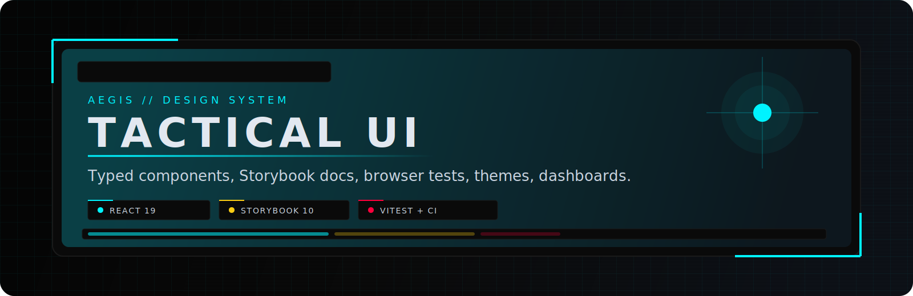

# AEGIS Design System

AEGIS is a React 19 design-system workspace for building tactical, terminal-inspired interfaces with a consistent visual language and typed component API. The project combines theme foundations, reusable UI primitives, higher-level layout and workflow components, domain-specific presentation blocks, and a Storybook catalog that acts as both documentation and the main interaction test surface.

The design direction is deliberate rather than generic: HUD framing, grid overlays, mono-driven data presentation, alert-state color semantics, and operational dashboard patterns are all first-class parts of the system.

## What This Project Includes

- Typed React components exported from a single package entrypoint
- Design tokens and CSS variable contracts for dark/light theming
- Tailwind-powered global stylesheet bundled with the package
- Optional bundled local font assets for AEGIS display and mono typography
- SVG-based Material Symbols integration without font or CDN dependencies
- Storybook stories for components, foundations, and page-level assemblies
- Browser-based Storybook interaction tests with Vitest and Playwright
- Accessibility checks through Storybook a11y tooling
- ESLint and TypeScript static checks
- A small Vite app for local manual inspection outside Storybook

## Stack

- React 19
- TypeScript 5
- Vite 6
- Storybook 10 (`@storybook/react-vite`)
- Vitest browser mode
- Playwright
- ESLint 9 flat config
- Chromatic

## Design Philosophy

AEGIS is built for tactical product surfaces rather than consumer UI defaults.

- Typography emphasizes `Orbitron`, `JetBrains Mono`, and `Space Grotesk`
- Color semantics are operational: `primary`, `hazard`, `alert`, `success`, `ghost`
- Components are designed to look coherent in dashboards, control panels, operator views, and intelligence surfaces
- Foundation styles include HUD borders, scanlines, grid textures, terminal panels, and system status treatments

## Package Surface

Primary exports live in [`src/index.ts`](./src/index.ts).

## Installation

```bash
npm install @azelenets/aegis-design-system
```

Peer dependencies:

- `react`
- `react-dom`

The package ships its compiled core stylesheet. Import the package entry once and the component styles are included automatically:

```tsx
import '@azelenets/aegis-design-system';
```

To load the bundled AEGIS fonts as well, import the optional font stylesheet:

```tsx
import '@azelenets/aegis-design-system/fonts.css';
```

That keeps the default bundle smaller for consumers who do not need the exact design-system typography.

If you prefer an explicit style import, use either of these exports:

```tsx
import '@azelenets/aegis-design-system/styles.css';
// or
import '@azelenets/aegis-design-system/globals.css';
```

Minimal usage:

```tsx
import { Button, ThemeProvider } from '@azelenets/aegis-design-system';

export function App() {
  return (
    <ThemeProvider>
      <Button variant="primary">Launch</Button>
    </ThemeProvider>
  );
}
```

## Usage Examples

App setup with optional fonts:

```tsx
import '@azelenets/aegis-design-system/fonts.css';
import {
  ThemeProvider,
  ThemeToggle,
  Button,
  Card,
  CardBody,
  CardHeader,
} from '@azelenets/aegis-design-system';

export function App() {
  return (
    <ThemeProvider defaultTheme="dark">
      <main className="min-h-screen bg-bg-dark p-6">
        <div className="mb-4 flex justify-end">
          <ThemeToggle />
        </div>
        <Card variant="default">
          <CardHeader title="Mission Control" eyebrow="AEGIS" />
          <CardBody>
            <Button variant="primary">Launch Sequence</Button>
          </CardBody>
        </Card>
      </main>
    </ThemeProvider>
  );
}
```

Explicit stylesheet imports:

```tsx
import '@azelenets/aegis-design-system/styles.css';
import '@azelenets/aegis-design-system/fonts.css';
```

Typed icon usage:

```tsx
import { MaterialIcon, Tag } from '@azelenets/aegis-design-system';

export function ThreatStatus() {
  return (
    <div className="flex items-center gap-2">
      <MaterialIcon name="warning" className="text-alert text-[18px]" />
      <Tag label="Critical" variant="hazard" />
    </div>
  );
}
```

Data grid usage:

```tsx
import { DataGrid, type DataGridColumn } from '@azelenets/aegis-design-system';

type Operator = {
  id: string;
  callSign: string;
  sector: string;
};

const columns: DataGridColumn<Operator>[] = [
  { key: 'id', header: 'ID', sortable: true },
  { key: 'callSign', header: 'Call Sign', sortable: true },
  { key: 'sector', header: 'Sector' },
];

const rows: Operator[] = [
  { id: 'OP-001', callSign: 'GHOST', sector: 'Alpha-7' },
  { id: 'OP-002', callSign: 'RAVEN', sector: 'Delta-3' },
];

export function OperatorsTable() {
  return (
    <DataGrid
      columns={columns}
      data={rows}
      keyField="id"
      searchable
      caption="AEGIS // Operator Registry"
    />
  );
}
```

Map usage:

```tsx
import { Map, type MapMarker } from '@azelenets/aegis-design-system';

const markers: MapMarker[] = [
  { id: 'alpha', lat: 51.5007, lng: -0.1246, title: 'Alpha Node' },
  { id: 'beta', lat: 51.5081, lng: -0.0759, title: 'Beta Node' },
];

export function TacticalMap() {
  return (
    <Map
      ariaLabel="AEGIS tactical map"
      center={[51.505, -0.09]}
      zoom={12}
      markers={markers}
      fitMarkers
      height={420}
    />
  );
}
```

### Foundations

- `aegisTailwindTheme`
- `aegisTokens`
- `aegisCSSVars`
- `ThemeProvider`
- `useTheme`

CSS entrypoint:

- `@azelenets/aegis-design-system/styles.css`
- `@azelenets/aegis-design-system/globals.css`
- `@azelenets/aegis-design-system/fonts.css`

### Atoms

- `Avatar`
- `Badge`
- `Button`
- `Checkbox`
- `Divider`
- `Input`
- `Kbd`
- `MaterialIcon`
- `RadioGroup`, `RadioOption`
- `Rating`
- `SearchInput`
- `Select`
- `Skeleton`
- `Slider`
- `Spinner`
- `Tag`
- `Textarea`
- `ThemeToggle`
- `Toggle`
- `Tooltip`

### Molecules

- `Accordion`
- `Alert`
- `AvatarGroup`
- `Breadcrumbs`
- `Card`, `CardHeader`, `CardBody`, `CardFooter`
- `Form`, `FormSection`, `FormRow`, `FormActions`
- `Pagination`
- `ProgressBar`
- `ProgressCircle`

### Organisms

- `Carousel`, `CarouselSlide`
- `DataGrid`
- `Dropdown`, `DropdownItem`, `DropdownSeparator`, `DropdownGroup`
- `Footer`
- `Map`
- `Modal`, `ModalHeader`, `ModalBody`, `ModalFooter`
- `Navbar`
- `Sidebar`
- `Stepper`
- `Table`
- `Tabs`, `TabList`, `TabTrigger`, `TabPanel`
- `ToastProvider`, `Toaster`, `useToast`
- `Wizard`

### Layout

- `Container`
- `Grid`, `GridItem`
- `Overlay`
- `PageHeader`
- `Stack`, `HStack`, `VStack`, `ZStack`, `Spacer`, `Center`

### Domain Components

- Arsenal: `FilterButton`, `SpecCard`, `StatusItem`
- Credentials: `EntryCard`, `TagGroup`, `TimelineEntry`
- Dashboard: `StatBlock`, `StatCard`
- Laboratory: `LabCard`
- Mission Log: `MissionItem`

## Foundations

Theme tokens and CSS variables are defined in [`src/foundations/aegisTheme.ts`](./src/foundations/aegisTheme.ts). Global styles live in [`src/foundations/globals.css`](./src/foundations/globals.css).

Key foundation capabilities:

- Dark and light themes
- Semantic color tokens for state and status
- Shared panel, border, text, and background contracts
- Reusable visual utilities for HUD and terminal presentation
- App-level theme switching through `ThemeProvider`

## Tailwind and Styling

AEGIS uses Tailwind in the library build rather than a runtime CDN include.

- Consumers do not need to add a Tailwind CDN script
- The published package includes compiled CSS in `dist/index.css`
- The optional `dist/fonts.css` export carries the bundled font-face declarations
- Utility classes used internally are already compiled into the shipped stylesheet
- `aegisTailwindTheme` remains available for sharing token values with app-level Tailwind config

## Typography Assets

The design system ships an optional local font bundle for the families used by the component system:

- `Orbitron`
- `JetBrains Mono`

These fonts are loaded through local `@font-face` declarations in [`fonts.css`](./src/foundations/fonts.css). No Google Fonts dependency is required in either the library or Storybook.

## Icons

Material symbols are rendered through [`MaterialIcon`](./src/components/atoms/MaterialIcon.tsx), backed by `@material-symbols-svg/react`.

- Icons are SVG React components, not font glyphs
- No Google Fonts or icon CDN dependency is required
- Icon props across the component API use a typed `MaterialIconName` union
- Filled variants are supported where the icon set provides them, such as `star` in `Rating`

Example:

```tsx
import { MaterialIcon } from '@azelenets/aegis-design-system';

export function Status() {
  return <MaterialIcon name="warning" className="text-aegis-alert" />;
}
```

## Project Structure

```text
src/
  components/
    arsenal/
    atoms/
    credentials/
    dashboard/
    laboratory/
    layout/
    mission-log/
    molecules/
    organisms/
  foundations/
  pages/
  App.tsx
  index.ts
  main.tsx

.storybook/
  main.ts
  preview.ts
  vitest.setup.ts
```

Stories live beside components as `*.stories.tsx`.

## Local Development

Install dependencies:

```bash
npm install
```

Run the Vite app:

```bash
npm run dev
```

Run Storybook:

```bash
npm run storybook
```

Typical local URLs:

- Vite app: `http://localhost:5173`
- Storybook: `http://localhost:6007`

## Scripts

```bash
npm run dev
npm run build
npm run lint
npm run lint:fix
npm run typecheck
npm run storybook
npm run build-storybook
npm run test-storybook
npm run test-storybook:watch
npm run test-storybook:coverage
npm run visual-test
npm run publish:npm
```

Meaning:

- `build`: production Vite build
- `lint`: ESLint across the workspace
- `typecheck`: TypeScript compile-time validation with `tsc --noEmit`
- `test-storybook`: Storybook interaction suite
- `test-storybook:coverage`: Storybook interaction suite with V8 coverage output
- `publish:npm`: publish the package to `npmjs.org`

## Testing and Quality Gates

This repo uses Storybook as the main component validation surface.

- Stories provide documentation and executable interaction coverage
- Vitest runs Storybook stories in browser mode
- Playwright powers the browser environment
- Coverage is produced via `@vitest/coverage-v8`
- ESLint enforces code quality
- TypeScript enforces API and usage correctness

Coverage output is written to [`coverage/storybook`](./coverage/storybook) when the coverage script runs.

## CI

GitHub Actions workflow lives in [`.github/workflows/storybook-tests.yml`](./.github/workflows/storybook-tests.yml).

Current CI structure:

- `static-checks` job
  - `npm ci`
  - `npm run lint`
  - `npm run typecheck`
- `storybook-tests` job
  - `npm ci`
  - Playwright Chromium install
  - `npm run test-storybook:coverage`
  - coverage artifact upload
- `chromatic` job
  - runs on push
  - waits for both static checks and Storybook tests

Static checks and Storybook browser tests run in parallel to reduce total CI time.

## Storybook Scope

The Storybook catalog includes:

- foundation stories for themes, spacing, color, and typography
- component stories for every exported UI tier
- domain stories for tactical/dashboard-specific building blocks
- a page-level `AEGIS Ops Dashboard` composition story

That makes Storybook the primary place to:

- inspect component behavior
- validate interaction flows
- verify visual hierarchy and theme behavior
- test complex compositions like grids, modals, wizards, tables, maps, and dashboards

## Notable Components

Some higher-value surfaces in this system:

- `DataGrid`: filtering, sorting, pagination, density, selection, expansion, column visibility
- `Wizard`: controlled/uncontrolled step flows with validation hooks
- `Map`: Leaflet-backed tactical map surface with themed overlays and markers
- `Tabs`, `Sidebar`, `Navbar`, `Footer`: application shell composition pieces
- `Modal`, `Toast`, `Overlay`, `Dropdown`: operational interaction primitives
- `Carousel`, `Stepper`, `Table`: high-level display and workflow components

## Intended Use

AEGIS is a good fit for:

- internal operations dashboards
- command-center and monitoring UIs
- security/admin consoles
- system control panels
- intelligence, mission, or infrastructure reporting tools

It is less about generic marketing-site components and more about structured, status-rich application interfaces.

## Notes

- The Vite app in [`src/App.tsx`](./src/App.tsx) is a local preview shell, not the primary documentation surface.
- Storybook remains the canonical showcase and test surface for the component library.
